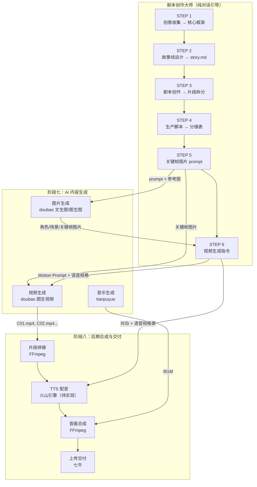

# AI Media Skills

基于 Claude Code 的 AI 多媒体创作技能集，覆盖从创意策划、内容生成、后期编辑到交付上线的完整工作流。用自然语言对话即可完成图片生成、视频生成、音乐创作、视频剪辑和文件交付，所有SKILL都已经封装好调用细节，用户只需专注于创意表达和需求描述，剩下的交给Claude Code和背后的AI模型来实现。

## 快速开始

### 1. 安装依赖

需要以下工具：

- **Node.js** 18+ — Claude Code 运行环境
- **Python** 3.14+ — 脚本执行环境
- **uv** — Python 包管理器（[安装文档](https://docs.astral.sh/uv/)）

```bash
# 安装 Claude Code
npm install -g @anthropic-ai/claude-code

# 安装 uv（如果尚未安装）
pip install uv
# 或
curl -LsSf https://astral.sh/uv/install.sh | sh
```

安装后运行 `claude` 进入交互界面。

Claude Code 需要接入大模型提供商（推荐以下两家，与内容生成供应商独立）：

| 大模型提供商 | 官网 |
|-------------|------|
| 智谱 AI（GLM） | [open.bigmodel.cn](https://open.bigmodel.cn) |
| MiniMax | [platform.minimaxi.com](https://platform.minimaxi.com) |

### 2. 配置环境变量

将环境变量配置到系统或 shell profile 中（`.bashrc` / `.zshrc` / PowerShell profile）：

```bash
# 按需配置，需要使用什么功能，就配置对应的KEY
export ARK_API_KEY="你的火山引擎密钥"          # 豆包生图/生视频
export TIANPUYUE_API_KEY="你的天谱乐密钥"      # 天谱乐生音乐/歌曲/歌词

# 可选
export QINIU_ACCESS_KEY="你的七牛AK"          # 七牛上传/交付
export QINIU_SECRET_KEY="你的七牛SK"
export QINIU_BUCKET="你的存储空间名"
export QINIU_PUBLIC_DOMAIN="你的公网域名"
```

> FFmpeg 需要在系统 PATH 中安装（full build 8.1+）。

### 3. 克隆并进入项目

```bash
git clone https://github.com/ShowTimeWalker/ai-media-gen-skills.git
cd ai-media-gen-skills
claude
```

### 4. 用自然语言开始创作

在 Claude Code 对话中直接描述需求即可，例如：

| 你说的 | 效果 |
|--------|------|
| "帮我生成一张雪中小猫的图片" | 豆包文生图 |
| "根据这张图生成一段视频" | 豆包图生视频 |
| "生成一段轻快的钢琴背景音乐" | 天谱乐生成纯音乐 |
| "帮我写一首关于青春的歌" | 天谱乐生成歌曲 |
| "把这段视频裁剪成 15 秒" | FFmpeg 剪辑 |
| "上传到七牛给我链接" | 七牛上传交付 |

所有生成的文件保存在 `outputs/` 目录下。

---

## 完整工作流管线

整个管线分为 **8 个阶段**，前 6 个阶段由剧本创作大师通过对话引导完成，后 2 个阶段由原子能力 Skill 执行。

```
╔══════════════════════════════════════════════════════════════════╗
║                  剧本创作大师（纯对话引导）                         ║
╠══════════════════════════════════════════════════════════════════╣
║                                                                  ║
║  STEP 1          STEP 2          STEP 3          STEP 4          ║
║  创意收集         故事线设计       剧本创作         生产脚本        ║
║  → 核心框架       → 大纲+篇章     → 片段拆分       → 分镜表        ║
║    framework.md     story.md     (8-9秒/片段)     (镜号/景别/运镜)║
║                                                                  ║
║  STEP 5          STEP 6                                  ║
║  关键帧图片       视频生成指令                              ║
║  → 参考图         → Motion Prompt                         ║
║    prompt        → 声音设计                                ║
║    (角色+场景)     → 语音规格表                              ║
║                                                                  ║
╚══════════════════════════════╦════════════════════════════════════╝
                               ║
                               ▼
╔══════════════════════════════════════════════════════════════════╗
║                    阶段七：AI 内容生成                            ║
╠══════════════════════════════════════════════════════════════════╣
║                                                                  ║
║  ┌─ 图片生成 ─────────────────────────────────────────────┐      ║
║  │  角色参考图 / 场景参考图 → doubao 文生图                │      ║
║  │  关键帧（首帧/末帧）     → doubao 文生图 / 图生图       │      ║
║  │  依赖：STEP 5 图片 prompt + 参考图                     │      ║
║  └─────────────────────────────────────────────────────────┘      ║
║                                                                  ║
║  ┌─ 视频生成 ─────────────────────────────────────────────┐      ║
║  │  首帧图片 + Motion Prompt → doubao 图生视频             │      ║
║  │  依赖：STEP 5 关键帧图片 + STEP 6 视频指令             │      ║
║  └─────────────────────────────────────────────────────────┘      ║
║                                                                  ║
║  ┌─ 音乐生成 ─────────────────────────────────────────────┐      ║
║  │  BGM / 主题曲 → tianpuyue 纯音乐或歌曲生成             │      ║
║  └─────────────────────────────────────────────────────────┘      ║
║                                                                  ║
╚══════════════════════════════╦════════════════════════════════════╝
                               ║
                               ▼
╔══════════════════════════════════════════════════════════════════╗
║                   阶段八：后期合成与交付                           ║
╠══════════════════════════════════════════════════════════════════╣
║                                                                  ║
║  ① 片段拼接      单片段视频 → FFmpeg 拼接为完整集数视频          ║
║  ② TTS 配音      对白 / OS → 火山引擎 TTS（待实现）              ║
║  ③ 音画合成      配音 + BGM + 视频 → FFmpeg 合成                 ║
║  ④ 上传交付      成片 → 七牛对象存储 → 交付链接                   ║
║                                                                  ║
╚══════════════════════════════════════════════════════════════════╝
```

### Mermaid 流程图



### 阶段衔接

| 衔接点 | 上游产出 | 下游消费 |
|--------|---------|---------|
| STEP 5 → 图片生成 | `reference_images/` 下的 prompt 文件 | doubao 文生图 / 图生图 |
| STEP 5 → STEP 6 | `reference_images/` 下的实际关键帧图片 | STEP 6 读取图片分析视觉差异 |
| STEP 6 → 视频生成 | `video_generation/` 下的指令文件 + 关键帧图片 | doubao 图生视频（首帧 + Motion Prompt） |
| 视频生成 → 片段拼接 | 单片段视频 `C01.mp4`, `C02.mp4`, ... | FFmpeg 拼接 |
| STEP 6 → TTS 配音 | 指令文件中的对白 + 语音规格表 | 火山引擎 TTS |

---

## Skills 一览

### 创作引导类（纯对话，不调用外部 API）

| 技能 | 管线阶段 | 触发词 | 说明 |
|------|---------|--------|------|
| **short-video-script-master** | STEP 1-6 | "点子王""编剧""剧本大师" | 从创意到视频生成指令的 6 阶段完整管线 |
| **video-prompt-craft** | 独立使用 | "视频提示词""video prompt" | 结构化引导，将模糊想法转化为专业英文视频提示词 |

### 内容生成类（调用 AI 供应商 API）

| 技能 | 管线阶段 | 触发词 | 说明 |
|------|---------|--------|------|
| **doubao-all-in-one** | 阶段七 | "豆包""火山引擎图片/视频" | 豆包（Seedream/Seedance）生成图片和视频 |
| **tianpuyue-music** | 阶段七 | "天谱乐""AI 音乐""BGM" | 天谱乐生成纯音乐、歌曲或歌词 |
| **content-generation-workflow** | 阶段七 | "工作流""流水线""编排" | 统一编排入口，调度上方两个 Skill + 交付 |

### 后期处理与交付类

| 技能 | 管线阶段 | 触发词 | 说明 |
|------|---------|--------|------|
| **ffmpeg-multimedia-editing** | 阶段八 | "FFmpeg""视频剪辑""拼接""压缩" | 20 种本地多媒体操作（拼接/转码/字幕/水印等） |
| **qiniu-object-storage** | 阶段八 | "上传""七牛""交付链接" | 上传文件到七牛，返回下载链接 |

## 模型供应商

| 供应商 | 用途 | 官网 |
|--------|------|------|
| 豆包（火山引擎） | 图片生成（Seedream）、视频生成（Seedance） | [火山引擎](https://www.volcengine.com/docs/82379/1399008?lang=zh) |
| 天谱乐 | 纯音乐、歌曲、歌词生成 | [天谱乐](https://platform.tianpuyue.cn/home) |
| 火山引擎 TTS | 语音合成 / 配音（待接入） | 复用 `ARK_API_KEY` |
| 七牛云 | 对象存储、文件分发 | [七牛云](https://www.qiniu.com/) |

## 输出目录

所有生成的文件统一输出到 `OUTPUT_ROOT/outputs/` 下：

```
outputs/
├── dramas/                          # 短剧项目（剧本大师产出 + 生成素材）
│   └── <项目名>_<yyyyMMdd>/
│       ├── framework.md             #   STEP 1: 核心框架
│       ├── story.md                 #   STEP 2: 主线总故事
│       ├── stories/                 #   STEP 2: 按篇章的故事文件
│       ├── screenplays/             #   STEP 3: 剧本 + 片段拆分
│       │   └── Chapter<序号>_<篇章名>/
│       ├── production_scripts/      #   STEP 4: 分镜表
│       │   └── Chapter<序号>_<篇章名>/
│       ├── reference_images/        #   STEP 5: 参考图 + 关键帧
│       │   ├── characters_prompt.md
│       │   ├── scenes_prompt.md
│       │   ├── character_images/
│       │   ├── scenes/
│       │   └── Chapter<序号>_<篇章名>/keyframes/
│       └── video_generation/        #   STEP 6: 视频指令 + 生成视频
│           └── Chapter<序号>_<篇章名>/
├── doubao/
│   ├── images/text_to_image/        # 豆包文生图
│   └── videos/                      # 豆包视频（文生/首帧生/首尾帧生）
├── tianpuyue/
│   ├── music/                       # 天谱乐纯音乐
│   ├── songs/                       # 天谱乐歌曲
│   └── lyrics/                      # 天谱乐歌词
├── ffmpeg/<operation>/              # FFmpeg 处理结果
└── logs/                            # 运行日志
```

## 环境变量

> API 密钥仅需在**使用对应功能时**配置，无需全部填写。

| 变量 | 必填 | 默认值 | 说明 |
|------|------|--------|------|
| `ARK_API_KEY` | 豆包生图/生视频时 | — | 火山引擎 Ark API 密钥（TTS 配音复用） |
| `TIANPUYUE_API_KEY` | 天谱乐生成音乐时 | — | 天谱乐 API 密钥 |
| `TIANPUYUE_CALLBACK_URL` | 否 | `https://example.com/callback` | 回调地址（轮询模式下可用占位值） |
| `QINIU_ACCESS_KEY` | 七牛上传时 | — | 七牛 Access Key |
| `QINIU_SECRET_KEY` | 七牛上传时 | — | 七牛 Secret Key |
| `QINIU_BUCKET` | 七牛上传时 | — | 存储空间名称 |
| `QINIU_PUBLIC_DOMAIN` | 七牛上传时 | — | 公网访问域名 |
| `QINIU_IS_PRIVATE` | 否 | `false` | 是否为私有空间 |
| `OUTPUT_ROOT` | 否 | `~` | 输出根目录 |

## 许可

MIT
